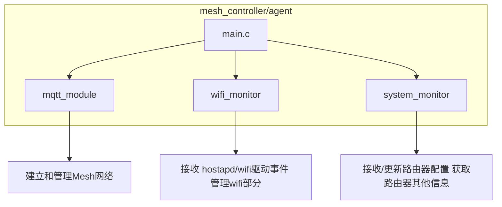

### Simple Mesh
Simple Mesh的目的：
*  建立一个尽量简单的开源mesh，实现mesh基本的功能，可以让开源爱好者进行模块化定制，和方便的使用。
* luci上可以设置需要同步的参数，和同步参数需要的命令，可以实现爱好者简单的定制。

### Simple Mesh 支持的功能
* wps 配对和网线配对
* 网络连接和网络恢复
* WIFI/LAN backhaul 切换
* 同步配置
* 同步的配置可以在luci上自定义
* 基于hostapd的漫游，支持通过ubus 控制手机漫游
* 客户端/mesh节点管理

### 自定义同步参数配置

SimpleMesh支持通过UCI配置文件自定义需要同步的参数。用户可以通过修改 `/etc/config/simple_mesh` 文件来定义获取和设置参数的shell命令。

#### 配置文件结构

```bash
# 主配置
config simple_mesh 'main'
	option enabled '1'
	option mqtt_broker '127.0.0.1'
	option mqtt_port '1883'
	option mqtt_client_id 'mesh_controller'
	option mode 'controller'

# 参数配置示例
config data_cmd 'wifi_ssid'
	option name 'WiFi SSID'
	option description '获取和设置WiFi SSID'
	option cmd_get 'uci get wireless.wlan1.ssid'
	option cmd_set 'uci set wireless.wlan1.ssid=%s && uci commit wireless && wifi reload'

config data_cmd 'wifi_password'
	option name 'WiFi Password'
	option description '获取和设置WiFi密码'
	option cmd_get 'uci get wireless.wlan1.key'
	option cmd_set 'uci set wireless.wlan1.key=%s && uci commit wireless && wifi reload'
```

#### 配置选项说明

- **name**: 参数名称，用于显示和识别
- **description**: 参数描述，说明参数的用途
- **cmd_get**: 获取参数值的shell命令
- **cmd_set**: 设置参数值的shell命令（%s为参数值占位符）

#### 自定义参数示例

**1. UCI配置参数**
```bash
config data_cmd 'lan_ip'
	option name 'LAN IP Address'
	option description '获取和设置LAN IP地址'
	option cmd_get 'uci get network.lan.ipaddr'
	option cmd_set 'uci set network.lan.ipaddr=%s && uci commit network && /etc/init.d/network restart'
```

**2. 系统文件参数**
```bash
config data_cmd 'hostname'
	option name 'Hostname'
	option description '获取和设置主机名'
	option cmd_get 'cat /proc/sys/kernel/hostname'
	option cmd_set 'echo %s > /proc/sys/kernel/hostname'
```

**3. 自定义配置文件参数**
```bash
config data_cmd 'custom_param'
	option name 'Custom Parameter'
	option description '自定义参数'
	option cmd_get 'cat /etc/config/custom_config | grep param1 | cut -d"=" -f2'
	option cmd_set 'sed -i "s/param1=.*/param1=%s/" /etc/config/custom_config'
```

**4. 服务状态参数**
```bash
config data_cmd 'ssh_enabled'
	option name 'SSH Enabled'
	option description '获取和设置SSH服务状态'
	option cmd_get 'uci get dropbear.@dropbear[0].enabled'
	option cmd_set 'uci set dropbear.@dropbear[0].enabled=%s && uci commit dropbear && /etc/init.d/dropbear restart'
```

#### 使用方法

1. **编辑配置文件**
   ```bash
   vi /etc/config/simple_mesh
   ```

2. **添加自定义参数**
   ```bash
   config data_cmd 'your_param'
   	option name 'Your Parameter'
   	option description 'Your parameter description'
   	option cmd_get 'your_get_command'
   	option cmd_set 'your_set_command %s'
   ```

3. **重启服务**
   ```bash
   /etc/init.d/simple_mesh restart
   ```

#### 注意事项

- `cmd_get` 命令应该只输出参数值，不要包含其他信息
- `cmd_set` 命令中的 `%s` 会被实际参数值替换
- 确保命令有足够的权限执行
- 建议在设置命令中包含必要的重启或重载操作
- 复杂的命令可以使用 `&&` 连接多个操作

#### Simple Mesh的代码架构



### 设计文档

#### 1. 项目概述

SimpleMesh 是一个面向 OpenWrt 平台的简易 Mesh 网络管理与监控系统，通过 MQTT 协议实现节点远程管理、状态监控和配置下发，适用于物联网无线组网场景。

#### 2. 主要模块

- **MQTT 客户端模块**（src/mqtt_client.c/.h, src/mqtt_topics.h）  
  负责与 MQTT Broker 建立连接，订阅/发布 Mesh 相关主题，实现消息收发与处理。

- **Mesh 数据与配置管理**（files/mesh_data, files/simple_mesh.config, src/uci_config.h）  
  存储和管理本地配置与运行数据，支持 UCI 配置管理，响应远程配置下发。

- **系统与 WiFi 监控模块**（src/system_monitor.c/.h, src/wifi_monitor.c/.h）  
  监控节点系统资源、WiFi 状态，定期上报云端，事件触发及时响应网络变化。

- **主程序入口**（src/main.c）  
  初始化各模块，启动主循环，处理信号。

#### 3. 运行流程

1. 启动初始化，加载配置，初始化 MQTT、监控模块等。
2. 连接 MQTT Broker，订阅相关主题。
3. 定时采集系统与 WiFi 状态，通过 MQTT 上报。
4. 接收云端下发的配置/命令，解析并执行。
5. 配置变更后写入本地文件，保证重启后生效。

#### 4. 关键设计点

- 模块化设计，便于维护和扩展。
- MQTT 通信采用主题分级，支持多节点并发管理。
- 配置管理兼容 OpenWrt UCI，支持远程和本地同步。
- 监控与事件驱动，及时响应网络变化。
