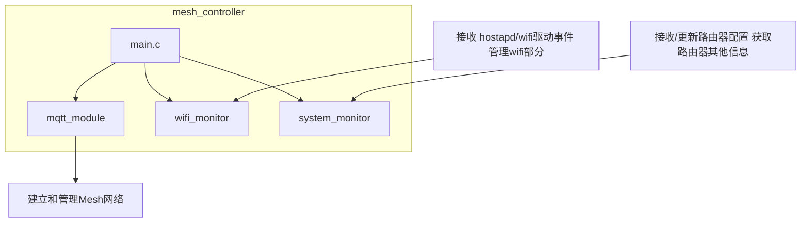

### Simple Mesh
Simple Mesh的目的：
*  建立一个尽量简单的开源mesh，实现mesh基本的功能，可以让开源爱好者进行模块化定制，和方便的使用。
* luci上可以设置需要同步的参数，和同步参数需要的命令，可以实现爱好者简单的定制。

### Simple Mesh 支持的功能
* wps 配对和网线配对
* 网络连接和网络恢复
* WIFI/LAN backhaul 切换
* 同步配置
* 同步的配置可以在luci上自定义
* 基于hostapd的漫游
* 客户端/mesh节点管理
#### Simple Mesh的代码架构

