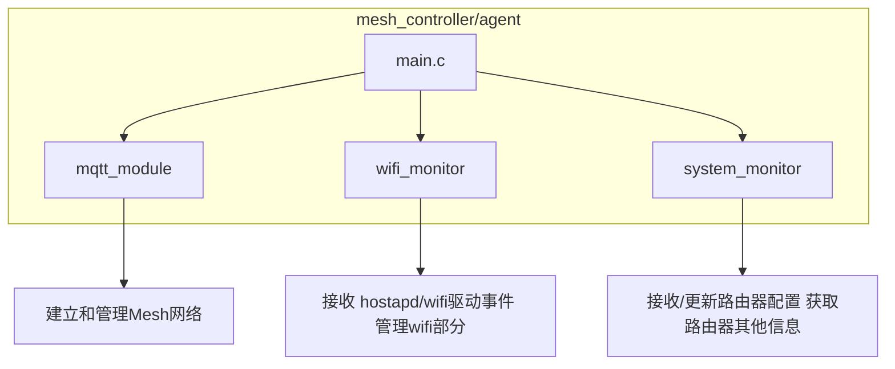

### Simple Mesh
Simple Mesh的目的：
*  建立一个尽量简单的开源mesh，实现mesh基本的功能，可以让开源爱好者进行模块化定制，和方便的使用。
* luci上可以设置需要同步的参数，和同步参数需要的命令，可以实现爱好者简单的定制。

### Simple Mesh 支持的功能
* wps 配对和网线配对
* 网络连接和网络恢复
* WIFI/LAN backhaul 切换
* 同步配置
* 同步的配置可以在luci上自定义
* 基于hostapd的漫游，支持通过ubus 控制手机漫游
* 客户端/mesh节点管理

## 参数同步与批量下发机制

本项目通过配置文件和脚本，实现了需要同步的参数的获取，和同步数据后，生效配置。只需在 `/etc/config/simple_mesh` 中定义参数，无需修改脚本，即可实现灵活扩展。

---

### 1. 配置文件格式（/etc/config/simple_mesh）

每个可同步参数用 `data_cmd` section 定义。例如：

```bash
config data_cmd 'wifi_2g_ssid'
	option description '获取和设置WiFi SSID'
	option cmd_get 'uci get wireless.wlan0.ssid'
	option cmd_set 'uci set wireless.wlan0.ssid=$sync_data'

config data_cmd 'wifi_2g_password'
	option description '获取和设置WiFi密码'
	option cmd_get 'uci get wireless.wlan0.key'
	option cmd_set 'uci set wireless.wlan0.key=$sync_data'
```

- **section name**（如 `wifi_2g_ssid`）即参数标识
- **cmd_get**：获取参数值的命令
- **cmd_set**：设置参数值的命令，`$sync_data` 为占位符

---

### 2. 获取所有可同步参数（get_sync_data.sh）

该脚本会自动遍历所有 type 为 `data_cmd` 的 section，执行其 `cmd_get`，并输出如下 JSON：

```json
{
  "sync_data": {
    "wifi_2g_ssid": "当前SSID",
    "wifi_2g_password": "当前密码",
    ...
  }
}
```

**用法示例：**

```sh
./get_sync_data.sh
```

---

### 3. 批量设置参数（apply_sync_data.sh）

该脚本接收一个 JSON 字符串（或文件），自动遍历 `sync_data` 下的每个 key，查找对应的 `cmd_set`，用 value 替换 `$sync_data` 并执行，实现批量参数下发。

**用法示例：**

```sh
./apply_sync_data.sh '{"sync_data": {"wifi_2g_ssid": "newssid", "wifi_2g_password": "newpass"}}'
```

---

### 4. 自定义参数示例

**添加自定义参数只需在配置文件中增加一段：**

```bash
config data_cmd 'lan_ip'
	option description '获取和设置LAN IP'
	option cmd_get 'uci get network.lan.ipaddr'
	option cmd_set 'uci set network.lan.ipaddr=$sync_data && uci commit network && /etc/init.d/network restart'
```

**即可自动支持同步和批量下发，无需修改脚本。**

---

### 5. 常见问题

- **cmd_set** 里的 `$sync_data` 会被自动替换为 JSON 里的 value
- 支持任意 shell 命令，只要能通过 shell 执行即可
- 建议所有参数都用 `data_cmd` section 统一管理

---

## 总结

- **参数定义**：只需在 `/etc/config/simple_mesh` 里添加 `data_cmd` 段
- **获取所有参数**：`get_sync_data.sh` 自动输出 JSON
- **批量设置参数**：`apply_sync_data.sh` 自动解析 JSON 并执行设置命令

这样即可实现灵活、自动化的参数同步与批量下发，无需手动维护脚本内容！

#### Simple Mesh的代码架构



### 设计文档

#### 1. 项目概述

SimpleMesh 是一个面向 OpenWrt 平台的简易 Mesh 网络管理与监控系统，通过 MQTT 协议实现节点远程管理、状态监控和配置下发，适用于物联网无线组网场景。

#### 2. 主要模块

- **MQTT 客户端模块**（src/mqtt_client.c/.h, src/mqtt_topics.h）  
  负责与 MQTT Broker 建立连接，订阅/发布 Mesh 相关主题，实现消息收发与处理。

- **Mesh 数据与配置管理**（files/mesh_data, files/simple_mesh.config, src/uci_config.h）  
  存储和管理本地配置与运行数据，支持 UCI 配置管理，响应远程配置下发。

- **系统与 WiFi 监控模块**（src/system_monitor.c/.h, src/wifi_monitor.c/.h）  
  监控节点系统资源、WiFi 状态，定期上报云端，事件触发及时响应网络变化。

- **主程序入口**（src/main.c）  
  初始化各模块，启动主循环，处理信号。

#### 3. 运行流程

1. 启动初始化，加载配置，初始化 MQTT、监控模块等。
2. 连接 MQTT Broker，订阅相关主题。
3. 定时采集系统与 WiFi 状态，通过 MQTT 上报。
4. 接收云端下发的配置/命令，解析并执行。
5. 配置变更后写入本地文件，保证重启后生效。

#### 4. 关键设计点

- 模块化设计，便于维护和扩展。
- MQTT 通信采用主题分级，支持多节点并发管理。
- 配置管理兼容 OpenWrt UCI，支持远程和本地同步。
- 监控与事件驱动，及时响应网络变化。
