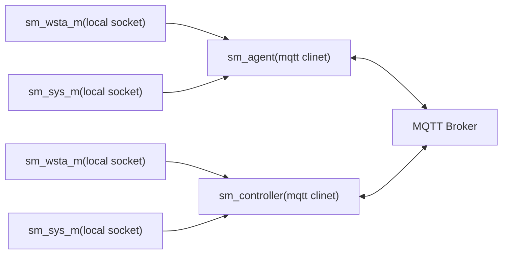
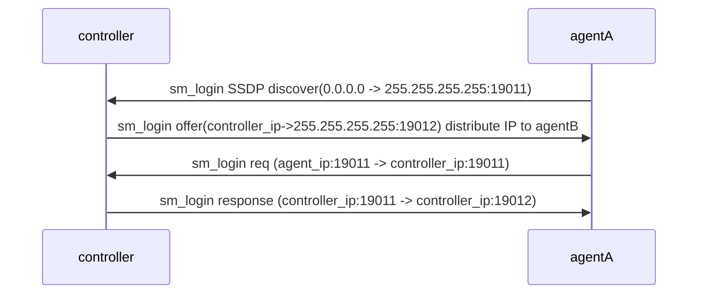

# SimpleMesh 
SimpleMesh
*  sm_controller: Mesh controller , subscribe agent topic, submit controller topic
*  sm_agent: Mesh agent, subscribe agent topic and controller topic, submit agent topic
*  sm_wsta_m: wireless STA monitor, monitor wireless STA status, get/send wifi management pkt to STA.
*  sm_sys_m: system monitor, get/set router settings/monitor lan network

# Communication

# Login

