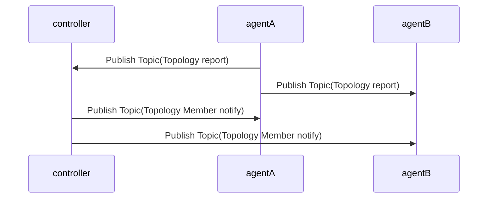
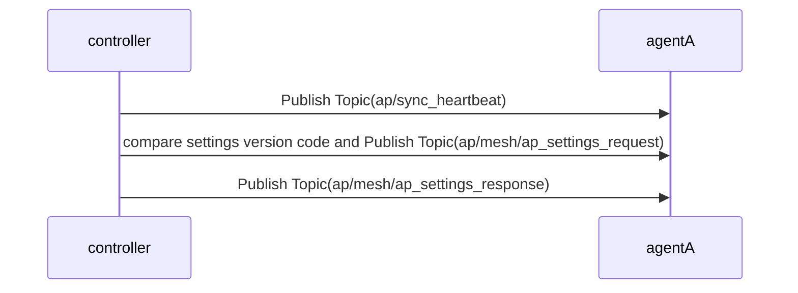
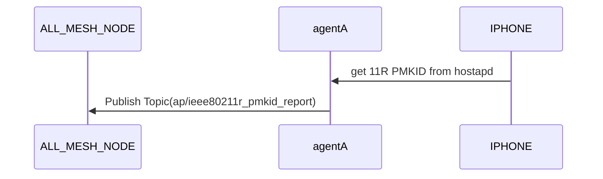
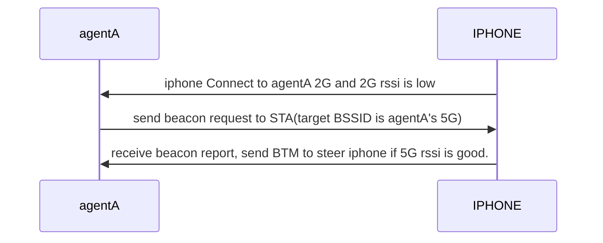
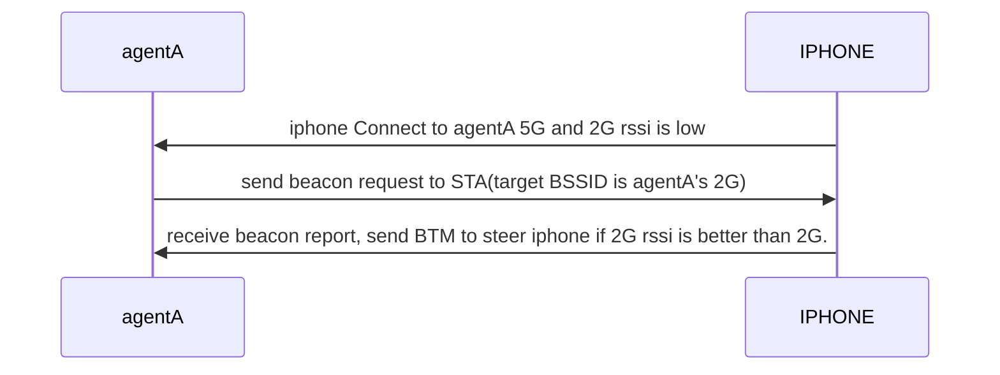
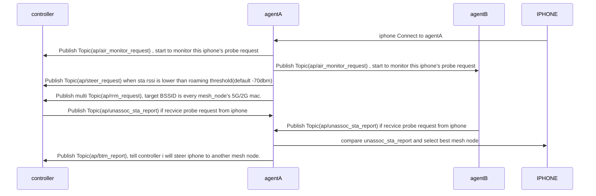
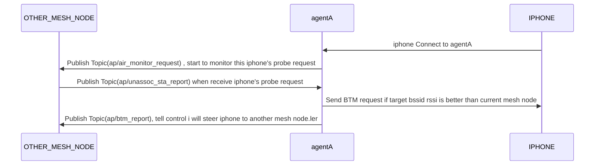

#### NEW agent connect to controller

#### Auto-Configuration

#### 11R 

#### BANDSTEERING 2G-->5G

#### BANDSTEERING 5G-->2G

#### ROAMING & AIR Monitor

Case 1: roaming then rssi is terrible

case 2: Auto-roaming trigger by air monitor
