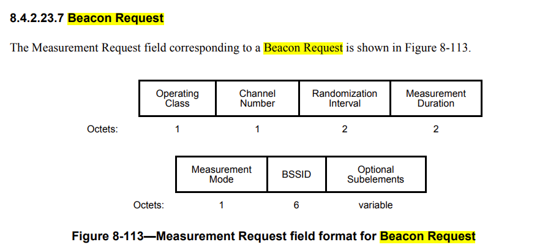
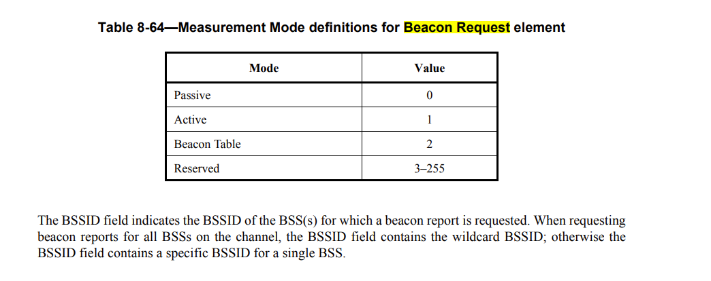

# 802.11k RRM

### RRM include:
* Beacon Request/Report
* Frame Request/Report
* Channel Load Request/Report
* Measurement Pilot
* Noise Histogram Request/Report
* STA Statistics Request/report
* Location
* Measurement pause
* Neighbor Request/report
* Link measurement
* Transmit stream/category measurement
* AP Channel Request/Report


#### Beacon request



##### How to send Beacon request via ubus+hostapd (test on mt7621+7603+7613)
1. Enable 11k in your wifi radio:
```
wireless.wlan1=wifi-iface
wireless.wlan1.device='radio1'
wireless.wlan1.ifname='wlan1'
wireless.wlan1.network='lan'
wireless.wlan1.mode='ap'
wireless.wlan1.ssid='OpenWrt'
wireless.wlan1.encryption='psk2+ccmp'
wireless.wlan1.key='12345678'
wireless.wlan1.ieee80211w='0'
wireless.wlan1.ieee80211k='1' <--
```
2. Check is it enable
```
    Smart Phone connect to your wifi

    call 


{
        "freq": 5745,
        "clients": {
                "b6:c7:f8:aa:23:0a": {
                        "auth": true,
                        "assoc": true,
                        "authorized": true,
                        "preauth": false,
                        "wds": false,
                        "wmm": true,
                        "ht": true,
                        "vht": true,
                        "he": false,
                        "wps": false,
                        "mfp": false,
                        "mbo": false,
                       ---> "rrm": [
                                115,
                                16,
                                145,
                                0,
                                4
                        ],
                        ....
                }
```

3. recv ubus hostapd event 
```
ubus subscribe hostapd.wlan1
```
4. send beacon request
```
root@OpenWrt:/# ubus -v list hostapd.wlan1
'hostapd.wlan1' @f0f6bff2
...
        "rrm_beacon_req":{"addr":"String","mode":"Integer","op_class":"Integer","channel":"Integer","duration":"Integer","bssid":"String","ssid":"String"}
...

```

```
ubus call hostapd.wlan1 rrm_beacon_req '{"addr":"b6:c7:f8:aa:23:0a", "mode":0,"op_class":115,"channel":149,"duration":1,"bssid":"ff:ff:ff:ff:ff:ff","ssid":"HITTTTTTTTTTTTTTTT"}'

```

5. check the result
```
root@OpenWrt:~# ubus subscribe hostapd.wlan1
{ "beacon-report": {"address":"b6:c7:f8:aa:23:0a","op-class":115,"channel":0,"start-time":0,"duration":0,"report-info":128,"rcpi":0,"rsni":0,"bssid":"00:00:00:00:00:00","antenna-id":0,"parent-tsf":0,"rep-mode":0} }
{ "probe": {"address":"b6:c7:f8:aa:23:0a","target":"ff:ff:ff:ff:ff:ff","signal":-31,"freq":5745,"ht_capabilities":{"ht_capabilities_info":2543,"supported_mcs_set":{"a_mpdu_params":23,"ht_extended_capabilities":0,"tx_bf_capability_info":0,"asel_capabilities":0,"supported_mcs_set":[255,255,0,0,0,0,0,0,0,0,0,0,0,0,0,0]}},"vht_capabilities":{"vht_capabilities_info":865204726,"vht_supported_mcs_set":{"rx_map":-6,"rx_highest":780,"tx_map":-6,"tx_highest":8972}}} }
```